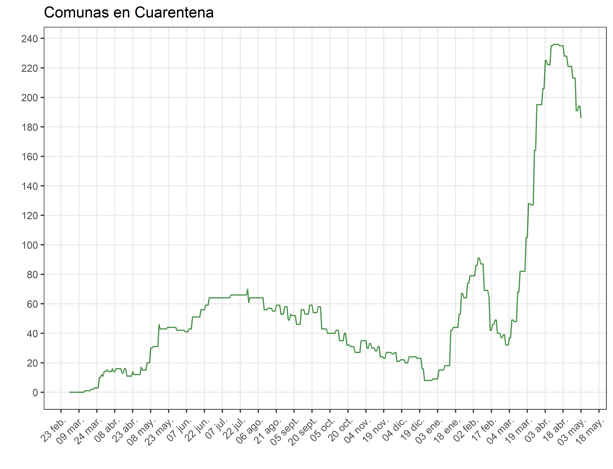

# Cuarentenas
Información a nivel comunal y diario de las cuarentenas impuestas en Chile.
Esta información se ha digitalizado utilizando los reportes que realiza el Ministerio de Salud. La información contenida puede diferir por concepto de horas en la aplicación de una cuarentena, por lo cual, se pide utilizar bajo ese cuidado e informar si estos datos difieren sustancialmente. Notar que se considera comuna en cuarentena solo las que están en fase 1, desde fase 2 en adelante se encuentran clasificadas como 0.

## Variables
- **comuna**: Código único de comuna
- **region**: Código único de región
- **nombre**: Nombre de comuna
- **dd-mm-yyyy**: Variables binarias que toman valor 1 si la comuna tiene cuarentena total/parcial activa.

Gráfico de las comunas que se encuentran bajo cuarentena (Fase 1):

{:height="36px" width="36px"}

```
Última actualización al 21-01-2021.
```
